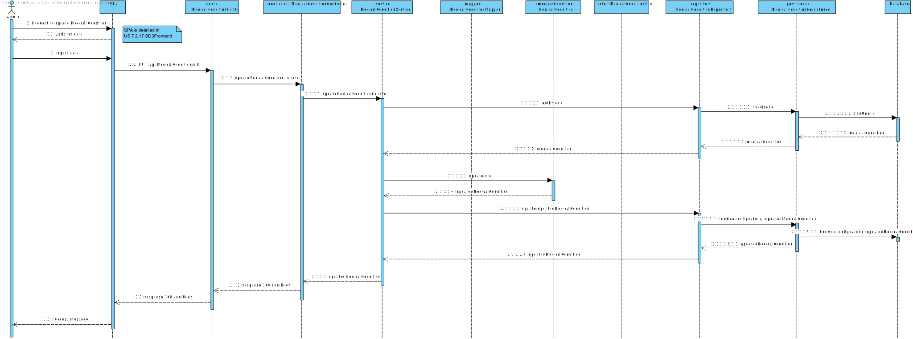

# US 7.2.17

## 1. Context

This task appears in the end of the project's development, to be able to update a medical condition.


## 2. Requirements

**US 7.2.17** As Admin I want to update a medical condition

**Acceptance Criteria:**

- Admins can update medical condition details such as the name, description and symptoms.
- The name and code are unique.
- The description is required.
- The access is based on role-based permissions

**Dependencies/References:**

It is also required that the user is registered and logged in as an admin.


## 3. Analysis

For this US were considered the requirements specified in the project's description and the client's answers. 
Some relevant answers excerpts are here specified:

```
Q: 
Dear client,

Regarding User Story 7.2.17, we would like to clarify the requirements for updating a medical condition. Could you please confirm which parameters the admin should be allowed to modify in this process?

A: 
it is possible to update the designation (to fix a typo for instance) and the description.

```

The following **HTTP requests** will be implemented:
- PUT (to update the medical condition)

## 4. Design

This section presents the design adopted to solve the requirement.

### 4.1. Sequence Diagram (Level 1)

 


### 4.2. Sequence Diagram (Level 2)

 


### 4.3. Sequence Diagram (Level 3)

### 4.3.1 Post (Level 3)
This diagram guides the realization of the functionality, for level 3 process view, for both backend and frontend.

**Backend**



**Frontend**


### 4.4. Applied Design Patterns

- **Domain Driven Development (DDD):** the focus is the business logic and not the implementation.
- **Data Transfer Object (DTO):** gives an abstraction layer to the domain, so that it's only presented specific information regarding the object.
- **Model View Controller (MVC):** allows the re-usability of components and promotes a more modular approach to the code, making it easier to manage and maintain.
- **Repository pattern:** allows access to data without sharing the details of data storing, like the database connection.
- **Service pattern:** helps keeping high cohesion and low coupling in the code by separating complex business logic from the rest of the system. They also promote reuse, as multiple parts of the system can use the same service to perform common operations.
- **Test Driven Development (TDD):** planning the tests previously to the code gives orientation lines to the development process.
- **Onion Architecture:** concentric layers structure that puts the Domin Model as the core. Promotes modularity, flexibility and testability.
- **Inversion of Control:** the responsability of object creation and dependency management belongs to a framework or external entity, so that the class doesn't need to. Promotes flexibility and decoupling.
- **Dependency Injection:** used to implement inversion of control. The dependencies are injected into a class from the outside.

### 4.5. Tests

The following tests are to be developed:
- The name must be unique.
- The name is required.
- The code must be unique.
- The code is required.
- The description is required.

All Value Objects will be tested in Unitary Tests, to check if they fullfill their requirements.

The medical condition Service will be tested to see if the updated medical condition is correct.

The medical condition Controller will be tested to see if the updated medical condition and responses are correct.


## 5. Implementation

The implementation of this US is according to the design, as can be seen in the diagrams presented before.

All commits referred the corresponding issue in GitHub, using the #38 and #51 tag, as well as a relevant commit message.


## 6. Integration/Demonstration

To update a medical condition, run the RecordsBackoffice app and AuthApp and send a PUT HTTP request with the updated data.

## 7. Observations

This work was guided by the project provided in ARQSI classes.