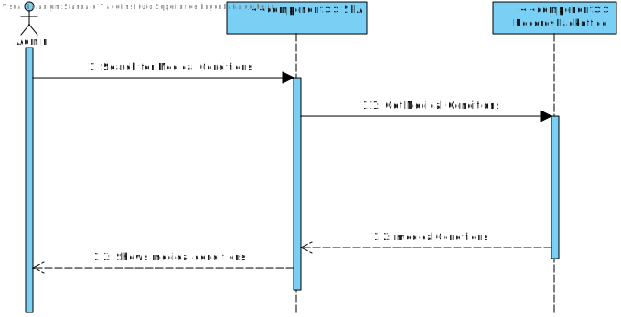
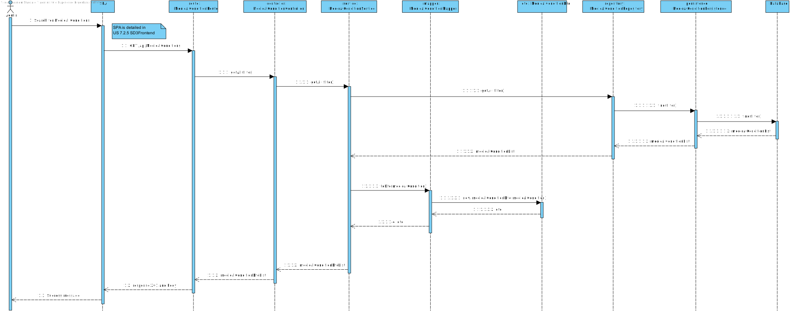

# US 7.2.5

## 1. Context

This task appears in the end of the project's development, to be able to search/filter for medical conditions.


## 2. Requirements

**US 7.2.5** As a Doctor, I want to search for Medical Conditions, so that I can use it to update the Patient Medical Record. 

**Acceptance Criteria:**

- The filter can be made with name and/or code.
- The access is based on role-based permissions

**Dependencies/References:**

It is also required that the user is registered and logged in as an admin.


## 3. Analysis

For this US were considered the requirements specified in the project's description and the client's answers. 
Some relevant answers excerpts are here specified:

```
Q: 
Dear client,

Regarding User Story 7.2.5, we would like to confirm how the search for medical conditions should work. Should the search return all registered medical conditions, or should it allow filtering based on a specific parameter? If it’s based on a parameter, could you specify which one?

A: 
This requirement is related to the adding/updating of an medical condition entry in the medical record. Thus, when the doctor is adding or editing a medical condition entry, they must be able to search for medical condition by code or designation instead of entering the "id" directly or selecting it from a drop down.

```

```
Q: 
What do you define as Medical Condition? Is it an allergy?

A: 
they are two different things.
a Medical Condition represents a diagnosed health issue or disease. Examples: Diabetes, Hypertension, Asthma, etc.

```

```
Q: 
Gostaria de lhe perguntar se existe alguma lista de medical conditions que prefere que utilizemos no sistema por default, se sim, quais?

A: 
default medical conditions (ICD-11):

A04.0 Cholera
A08.0: Rotavirus enteritis
B20: Human Immunodeficiency Virus (HIV) disease
B50: Plasmodium falciparum malaria
2A20.0: Malignant neoplasm of lung
2F44.0: Malignant neoplasm of the breast
3A01.1: Iron deficiency anemia
4A44: Hereditary hemochromatosis
5A11: Type 1 diabetes mellitus
5B55: Obesity
6A80: Major depressive disorder
6C40: Generalized anxiety disorder
FB20.1: Osteoporosis with pathological fracture
FB81.1: Osteoarthritis of the knee
FB81.2: Osteoarthritis of the hip
FB80.1: Rheumatoid arthritis
FA24.0: Fracture of femur
FA22.0: Fracture of radius and ulna
FA21.0: Dislocation of shoulder
FB70.0: Low back pain
```

```
Q: 
Também gostariamos de perguntar se quando diz "I want to search for Medical Conditions, so that I can use it to update the Patient Medical Record" o que é que implica a ultima parte?


A: 
quando o médico está a editar o registo médico do paciente, deve ter a possibilidade de inserir entradas de alergias e/ou condições médicas através de pesquisa de alergias/condições médicas

```


The following **HTTP requests** will be implemented:
- GET (to search/filter for medical conditions)

## 4. Design

This section presents the design adopted to solve the requirement.

### 4.1. Sequence Diagram (Level 1)

 


### 4.2. Sequence Diagram (Level 2)

 


### 4.3. Sequence Diagram (Level 3)

### 4.3.1 Post (Level 3)
This diagram guides the realization of the functionality, for level 3 process view, for both backend and frontend.

**Backend**



**Frontend**


### 4.4. Applied Design Patterns

- **Domain Driven Development (DDD):** the focus is the business logic and not the implementation.
- **Data Transfer Object (DTO):** gives an abstraction layer to the domain, so that it's only presented specific information regarding the object.
- **Model View Controller (MVC):** allows the re-usability of components and promotes a more modular approach to the code, making it easier to manage and maintain.
- **Repository pattern:** allows access to data without sharing the details of data storing, like the database connection.
- **Service pattern:** helps keeping high cohesion and low coupling in the code by separating complex business logic from the rest of the system. They also promote reuse, as multiple parts of the system can use the same service to perform common operations.
- **Test Driven Development (TDD):** planning the tests previously to the code gives orientation lines to the development process.
- **Onion Architecture:** concentric layers structure that puts the Domin Model as the core. Promotes modularity, flexibility and testability.
- **Inversion of Control:** the responsability of object creation and dependency management belongs to a framework or external entity, so that the class doesn't need to. Promotes flexibility and decoupling.
- **Dependency Injection:** used to implement inversion of control. The dependencies are injected into a class from the outside.

### 4.5. Tests

The following tests are to be developed:
- The name must be unique.
- The name is required.
- The code must be unique.
- The code is required.
- The description is required.

All Value Objects will be tested in Unitary Tests, to check if they fullfill their requirements.

The medical condition Service will be tested to see if the created medical condition is correct.

The medical condition Controller will be tested to see if the created medical condition and responses are correct.


## 5. Implementation

The implementation of this US is according to the design, as can be seen in the diagrams presented before.

All commits referred the corresponding issue in GitHub, using the #9 and #14 tag, as well as a relevant commit message.


## 6. Integration/Demonstration

To register a new medical condition, run the RecordsBackoffice app and AuthApp and send a POST HTTP request with the new data.

## 7. Observations

This work was guided by the project provided in ARQSI classes.