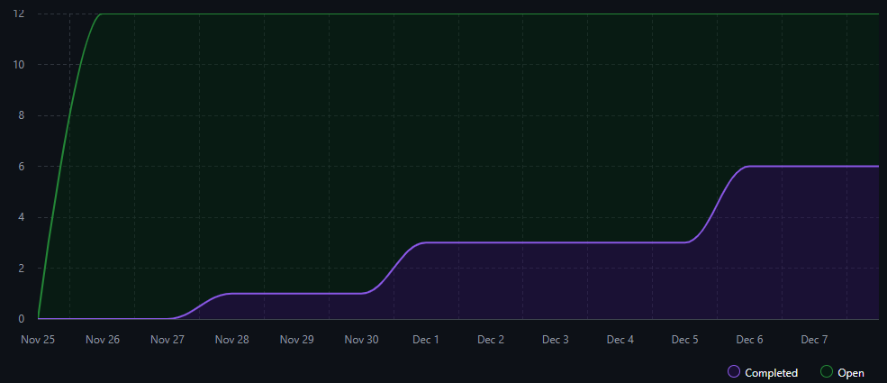

# Sprint Retrospective 

This sprint planning session was conducted on January 5, 2024, 16-17h.

## Introduction
The team gathered to review the last sprint, referred to as Sprint C.

The team concluded that it would be more effective to divide the six-week Sprint C into three shorter sprints of two weeks each. This division was intended to improve focus and allow for mid-sprint adjustments. The team collectively agreed to split Sprint C into Sprint C1, Sprin C2 and Sprint C3, each spanning two weeks.

Following this decision, the team analyzed the developed user stories (US), aiming to understand if the US were done, and if not, the reason behind it. The estimated times for each were also analyzed, to check if our prevision was right.
The burndown chart and its analyzis was done, as well as an overall view of the sprint and teamwork was also done.

## Sprint Division
- Sprint C1: November 25, 2024 – December 8, 2024
- Sprint C2: December 9, 2024 – December 22, 2024
- Sprint C3: December 23, 2024 – January 5, 2025

## Time Estimation

The team then proceeded to evaluate the estimated time required for each user story. Overall, the estimation was correct, with some US taking less time than estimated, namely the ones related to the RGPD module and some Integration US.
But some US took way more time than expected, like some Bacoffice US because of testing and the genetic algorithm.

## Burndown chart

The graph was generated in Github, considering all US's in the backend and frontend repositories.

**Sprint C1**

**Sprint C2**

**Sprint C3**

**Sprint C (Global)**

- In C1 the amount of work to be done was superior to the expected, meaning that the US were not being closed. 
The reason for this was that at the start of the sprint there were new technologies and languages to be learned, which delayed the issues conclusion.

- In C2 it happened the same has in C1, but more US's were assigned to sprint C2, so there were also more US's finished.

- In C3 the issues were being closed, so the result line was much closer to the expected, meaning that the team was working at a steady pace.

## Overview of the sprint

**Positive points:**
- The team already worked together in a previous project, so the relationships and working mechanics were already established.
- The US division took in consideration the work method and curricular units of each team member.
- When the base knowledge needed to develop the US was adquired, the work itself was done in an adequate pace.
- Everyone fullfilled their established tasks.

**Negative points:**
- The US were delayed due to having to learn new technologies and languages.
- More frequent commits.
- Not every issue implemented pull requests.

**Improvements:**
- Dividing the issues into smaller tasks, to prevent issues that are too dense.
